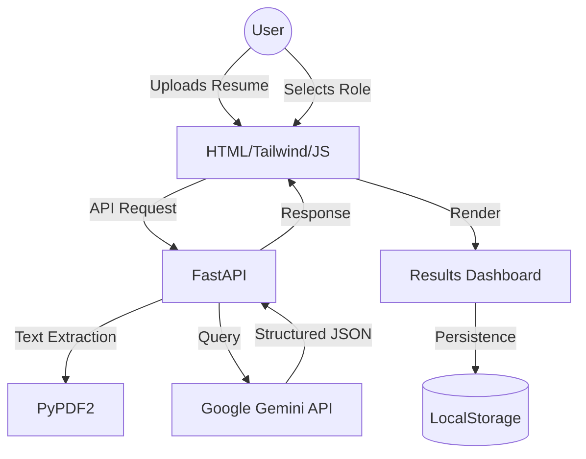

# CareerLens AI: Navigating Your Future with Precision

> [!IMPORTANT]
> **Bridging the gap between your current skills and your dream career using the power of Google Gemini AI.**

---

## 🌟 The Vision
In an era of rapid technological evolution, professionals often find themselves lost in the "Skill Gap." **CareerLens AI** is designed to act as a GPS for your career, analyzing your technical DNA and providing a crystal-clear, actionable roadmap to success.

---

## 🚀 Core Features

### 1. 🔍 Precision Gap Analysis
- **What it does**: Compares your resume against any target role with surgical precision.
- **Outcome**: A detailed breakdown of **Matched Skills**, **Missing Skills**, and a **Match Score**.
- **Tech**: Powered by Google Gemini's advanced semantic understanding.

### 2. 📊 The Results Dashboard
- **Radar Chart**: Visualize your technical profile at a glance.
- **Skill Matrix**: Deep dive into requirements with AI-generated advice for every gap.
- **Live Job Hub**: Instantly find opportunities tailored to your analyzed profile.

### 3. 🎯 Role Comparison Mode
- **Strategic Choice**: Can't decide between two paths? Compare them side-by-side. 
- **AI Verdict**: Get a strategic recommendation on which path offers the most immediate resonance or long-term growth.

### 4. 🤖 AI Career Advisor & Simulator
- **Chatbot**: A 24/7 mentor integrated into every page to answer career queries.
- **Interview Simulator**: Realistic mock interviews with scored feedback and role-aware critiques.
- **The Roaster**: A brutally honest (but helpful) AI critique of your resume to make you truly stand out.

---

## 🛠️ Technical Architecture

- **Frontend**: Clean, premium CSS with Tailwind and "Space Grotesk" typography.
- **Backend**: High-performance FastAPI with robust error handling.
- **Intelligence**: RAG-inspired pattern matching using Gemini for deep context.

---

## 📈 Impact
CareerLens AI doesn't just list skills; it provides a **5-step Learning Roadmap** and **Project Suggestions** to practically close those gaps. It transforms a static PDF into a dynamic, interactive career launchpad.

---

## 🔗 Try It Now
*Unlock your potential. Bridge the gap. Lead the way.*

---
*Created with ❤️ by the CareerLens AI Team*
